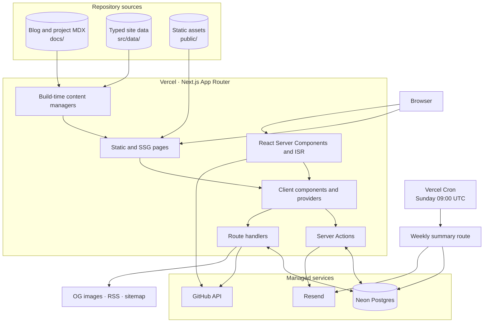
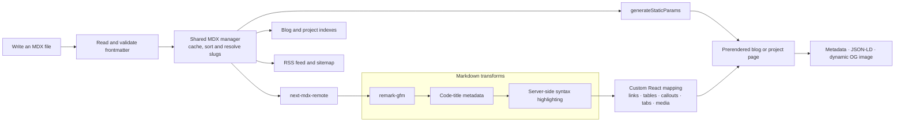
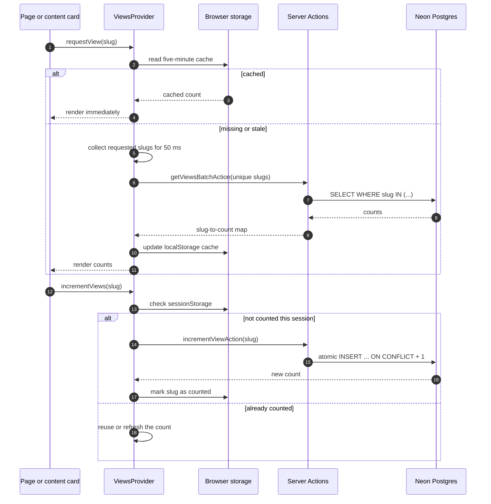

<h1 align="center">akasewang.me</h1>

<p align="center">
  The source for Akash Dewangan's personal site: software projects, technical writing,
  experiments, photography, a message board and a small newsletter system.
</p>

<p align="center">
  <a href="https://www.akasewang.me">Live site</a> ·
  <a href="#architecture">Architecture</a> ·
  <a href="#features">Features</a> ·
  <a href="#getting-started">Getting started</a> ·
  <a href="#commands">Commands</a> ·
  <a href="#documentation">Documentation</a>
</p>

<p align="center">
  
  
  
  
  
  
</p>

---

## Architecture

The site uses the Next.js App Router on Vercel. Content-heavy routes are prerendered from local
MDX, live features cross Server Actions or route handlers, and browser-only state stays in React,
the URL or short-lived web storage.

### System at a glance



### Content publishing pipeline

Blogs and projects share one typed MDX pipeline. The same source metadata also feeds navigation,
structured data and discovery endpoints, so publishing does not require maintaining parallel
indexes.



### View-count data flow

List pages do not make one database request per card. The client provider coalesces missing slugs
for 50 ms, performs one bounded batch read, and keeps the result locally for five minutes. A detail
page increments once per browser session with an atomic database upsert.



### Module ownership

| Path | Responsibility |
| --- | --- |
| `src/app/` | App Router pages, layouts, route handlers, metadata and generated endpoints |
| `docs/` | Blog and project MDX source files |
| `src/lib/managers/` | Typed MDX discovery, parsing, caching and sorting |
| `src/lib/actions/` | View, message-board and newsletter Server Actions |
| `src/lib/db/` | Drizzle schema and Neon database client |
| `src/components/common/mdx-components/` | MDX element mapping and interactive content components |
| `src/components/ui/` | Base UI primitives, Phosphor icons and reusable interaction patterns |
| `src/components/providers/` | Shared client-side motion and view-count state |
| `architecture/` | Focused design and implementation notes |

---

## Features

### Content and discovery

- Blogs and project case studies are authored in MDX with typed frontmatter.
- Custom MDX components provide callouts, steps, tabs, tables, code blocks, demos and zoomable
  images.
- Blog and project detail routes are statically generated from the files under `docs/`.
- RSS, XML sitemap, canonical metadata, JSON-LD and dynamic Open Graph images come from the same
  content sources.
- URL-backed filters and sorting keep list views shareable without introducing a global state
  manager.

### Live features

- Neon Postgres stores view counts, newsletter subscribers and message-board entries.
- View reads are batched and cached; increments use an atomic upsert and count once per session.
- The public message board includes a honeypot, IP-based cooldown, cursor pagination and protected
  admin replies/deletion.
- Resend and React Email power welcome emails, admin broadcasts and the weekly subscriber summary.
  The summary is sent even when the weekly count is zero.
- GitHub stars and changelog data are fetched server-side; an optional token raises the API limit
  without exposing credentials to the browser.

### Interface

- Tailwind CSS v4 and OKLCH custom properties define the visual system.
- Base UI supplies accessible tooltip, menu, select and tab foundations.
- Framer Motion is loaded through `LazyMotion`; layout, gesture and transition behavior remains
  component-owned.
- Phosphor duotone icons provide the shared icon language.
- Procedural Web Audio feedback follows one global preference and a documented interaction
  palette.
- `npm run dev` binds to the local network and prints a QR code for testing from a phone on the
  same Wi-Fi network.

### Repository safeguards

- ESLint checks TypeScript and React rules; Biome handles formatting.
- The pre-commit hook formats staged files after `npm install` configures the repository hook path.
- GitHub Actions runs `npm audit` for dependency changes, weekly on Monday, and on demand.
- Dependabot groups routine minor and patch dependency updates.

---

## Technology

| Layer | Choice |
| --- | --- |
| Framework | Next.js 16 App Router, React 19 |
| Language | TypeScript in strict mode |
| UI | Base UI, Tailwind CSS v4, Framer Motion |
| Icons | Phosphor Icons, duotone weight |
| Content | MDX, `next-mdx-remote`, Remark GFM, Rehype Highlight |
| Data | Neon Postgres, Drizzle ORM |
| Email | Resend, React Email |
| Hosting and telemetry | Vercel, Vercel Analytics, Speed Insights |
| Quality | ESLint, Biome, TypeScript, npm audit |

---

## Getting started

Prerequisites: Node.js 20.9 or newer, npm, a Neon Postgres database and a Resend account for email
features.

```powershell
git clone https://github.com/akasewang/akasewang.me.git
cd akasewang.me
npm install
Copy-Item .env.example .env
```

Configure `.env`, then synchronize the database schema and start development:

```powershell
npm run db:push
npm run dev
```

The terminal prints both the local URL and a mobile-preview QR code. The phone and development
machine must be connected to the same local network. If Windows, a VPN or a virtual adapter causes
the wrong address to be selected, override it explicitly:

```powershell
npm run dev -- --mobile-host 192.168.0.9
```

The wrapper verifies the selected URL before printing the QR code and automatically permits that
exact host for Next.js development resources. The override affects development only.

### Environment variables

| Variable | Required | Purpose |
| --- | --- | --- |
| `NEON_DATABASE_URL` | Yes | Neon Postgres connection string |
| `ADMIN_PASSWORD` | Yes for admin tools | Message-board and newsletter administration |
| `ADMIN_EMAIL` | Yes for weekly summaries | Recipient for the scheduled subscriber report |
| `RESEND_API_KEY` | Yes for email | Resend API authentication |
| `RESEND_FROM_EMAIL` | Production email | Verified sender address |
| `CRON_SECRET` | Yes in production | Bearer secret protecting the cron endpoint |
| `GITHUB_TOKEN` | No | Raises GitHub API limits; public requests remain the fallback |
| `NEXT_PUBLIC_ADMIN_LOGIN_PREFIX` | No | Custom browser-side admin login command |
| `NEXT_PUBLIC_ADMIN_LOGOUT_COMMAND` | No | Custom browser-side admin logout command |

Keep server secrets out of `NEXT_PUBLIC_*` variables. For Vercel, configure the same values in the
project's environment-variable settings; the weekly schedule itself is declared in `vercel.json`.

Vercel does not generate `CRON_SECRET`; it automatically sends the value you configure as a bearer
token when invoking the cron route. Generate a secure value with:

```bash
node -e "console.log(require('crypto').randomBytes(32).toString('hex'))"
```

Add the generated value as `CRON_SECRET` in the Vercel Production environment, then redeploy the
application so the scheduled route can authenticate successfully.

---

## Commands

| Command | Purpose |
| --- | --- |
| `npm run dev` | Start Next.js on the LAN and print the mobile QR code |
| `npm run build` | Create and validate the production build |
| `npm run start` | Serve the completed production build |
| `npm run lint` | Run ESLint across TypeScript and TSX source files |
| `npm run format` | Format the repository with Biome |
| `npm run security:audit` | Run the dependency vulnerability audit |
| `npm run email` | Preview React Email templates on port 3001 |
| `npm run db:push` | Push the Drizzle schema to Neon |

---

## Documentation

- [System overview](./architecture/overview.md) — hosting, rendering, data and SEO
- [MDX and content parsing](./architecture/mdx.md) — typed files, compilation and component mapping
- [State and hooks](./architecture/state.md) — URL state, caches and reusable client hooks
- [UI and animations](./architecture/ui.md) — visual tokens, motion and canvas effects
- [Audio feedback design system](./architecture/audio-design-system.md) — global preference and
  interaction sounds
- [Message board](./architecture/message-board.md) — validation, rate limiting and admin behavior
- [GitHub repository governance](./architecture/github.md) — automated audits, Dependabot and
  branch protection

---

## License

This project is licensed under
[CC BY-NC-SA 4.0](https://creativecommons.org/licenses/by-nc-sa/4.0/). You may study and adapt the
source for non-commercial work with attribution and share-alike terms. Personal branding, written
content and assets should be replaced before publishing a derivative.
